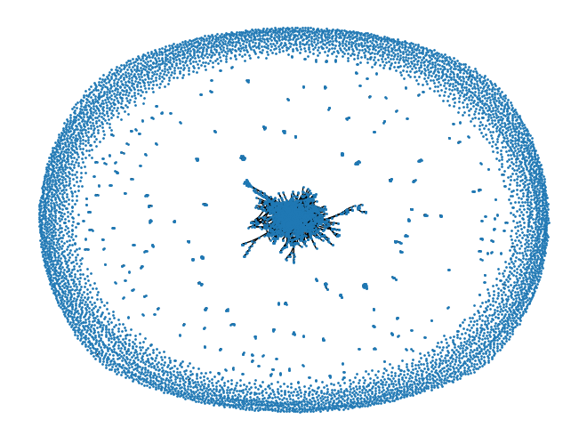

# 🔗 LinkedIn for AI-Researchers
## Table of Contents
* [About](#about)
* [Data acquisition](#data-acquisition)
* [Data feature](#data-feature)
* [Data preprocess](#data-preprocess)
* [Environment setting](#environment-setting)
* [Dataset](#dataset)
* [Method](#method)
* [How to run](#how-to-run)
* [Performance](#performance)
* [Analysis](#analysis)
* [Trials and future work](#trials-and-future-work)
---

## About
Career is a common interest for many AI-researchers. Unlike other job positions, the most important qualification for researchers is research fit with a company. However, it isn't easy to know what would be the company that will fit with one's research. 

To address this, we analyzed academic papers and their authors, specifically sourcing from [openreview](https://openreview.net), a prominent open-access archive. Our focus is on examining the affiliations of authors who contribute to leading AI conferences(NeurIPS, ICML, and ICLR), and discerning patterns between their research work and the institutions they are associated with. This project aims to serve as an effective career guidance tool, for not only the junior researchers but also senior researchers who are looking for their new and next career.

## Data acquisition 
1. Raw data filtering
- Filtering corrupted rows (e.g., missing author name)
- Completing empty entries (e.g., empty paper area using keywords)
 
2. Text processing (nltk library)
- Removing punctuations & symbols (e.g., 3D-Object -> 3D Object)
- Lowering of alphabet (e.g., 3D Object -> 3d object)
- Removing meaningless stop words (e.g., I, we, are, the, ... )
- Stemming words to base form (e.g., 'programmer', 'programming' -> 'program')
 
3. Tokenizing
- Pre-trained model: facebook/bart-base
- Keywords: single keyword each tokenized (e.g., 3d object -> tokenize '3d', tokenize 'object')
- Abstract: Text pre-processed abstract tokenized

### Data feature

#### Author feature
|    Type    |   Feature 1   | Feature 2   | Feature 3   |  Feature 4 | Feature 5 |  Feature 6 |  
|:------:|:---------:|:----------:|:------:|:--------:|:--------:|:--------:|  
| **Author** | author_id | author_name |  author_position  | author_affiliation  |   author_affiliation_type  | paper_id |

#### Paper feature
|    Type    |   Feature 1   | Feature 2   | Feature 3   |  Feature 4 | Feature 5 |   Feature 6   | Feature 7   | Feature 8   |  Feature 9 | Feature 10   | Feature 11   |  Feature 12 | Feature 13 |  
|:------:|:---------:|:----------:|:------:|:--------:|:--------:|  :---------:|:----------:|:------:|:--------:|:--------:|  :------:|:--------:|:--------:|  
| **Paper**  | paper_id  | name  | year | paper_number |  paper_venue |  paper_title  | paper_area | paper_keywords | paper_abstract |  paper_area | paper_title_tk | paper_keywords_tk |  paper_abstract_tk |  


## Data preprocess
We started by combining author and paper information, linking them together with a paper_id column to create a single dataset for each author.

We picked the most common words from abstracts, focusing on the top-n (n={300, 500, 1000}) words. For each record, we counted how many of these top words it had. If a word was found, we marked it as 1, and if it wasn't, we marked it as 0. This gave us a set of binary values (1s and 0s) for each record, which we used as our main features. In simple terms, our features were based on the words used in the abstracts.

We also noticed that the original dataset was unbalanced in terms of affiliations. To deal with this, we chose the five most common company affiliations (Google, Microsoft, DeepMind, Facebook, and Amazon) and the five most common university affiliations (MIT, Stanford University, Tsinghua University, Carnegie Mellon University, and Peking University), making a total of 10 affiliations for our analysis.
<p align="center">
    
</p>

As can be seen in the figure, most of the author affiliation is *Google*, (which is about ??%).  
Therefore, we performed oversampling/undersampling to handle the imbalanced data.

## Environment setting
* NVCC : 11.6
* GPU : RTX 3090
```
conda env create --file environment.yaml
```

## Dataset
We provide our dataset [here](https://drive.google.com/drive/folders/1kS5mJAHnnpPLVAxf5LwrOYpMn0Wdm8Im?usp=sharing). Please download *dataset* folder and place it in your working directory.

## Method
In our study, we utilized two well-known and effective machine learning models, XGBoost and Graph Attention Networks (GAT), which are widely recognized for their strength in recommendation tasks. These models were carefully trained with the specific goal of predicting an author's affiliation accurately. To provide a more tailored recommendation, we employed top-k prediction. This approach allows the models to suggest the most likely affiliations for an author, offering a range of possibilities ranked by their probability. By doing so, we aimed to ensure that the recommendations are both relevant and diverse, reflecting the varied nature of potential affiliations an author might have.

## How to run
For reproducibility, simply change the *seed* into 0,1 and 2 and calculate the average accuracy.
### XGBoost
```
CUDA_VISIBLE_DEVICES=0 python run_xgboost.py \
    --seed 0
```

### GAT
```
CUDA_VISIBLE_DEVICES=0 python GAT/main.py \
    --dropout 0.4 \
    --feature_dim 1000 \
    --seed 0 \
    --lr 0.005 \
    --dim_h 1024 \
    --heads 8 \
    --model GAT
```

## Performance
This is average accuracy over 3 seeds.

| Model   | Top-1 Accuracy | Top-3 Accuracy | Top-5 Accuracy |
|---------|----------------|----------------|----------------|
| XGBoost | 83.0%          | 100%           | 100%           |
| GAT     | 55%            | 73.2%          | 82.8%          |


## Analysis
Surprisingly, traditional machine learning approach (XGBoost) shows better performance than modern GNN models.  
We analyze the data and found that our data is highly disconnected which hinders message passing between the most of the nodes and prone to overfitting in a few subgraphs.

<p align="center">
    
</p>

Given the highly disconnected nature of our data, Graph Neural Networks (GNNs) proved to be less effective. Treating our data as tabular rather than graph-structured appears to be a more accurate representation of its characteristics.   


### Trials and future work
In attempts to mitigate this issue in GNN(GAT), we experimented with strategies like random edge addition, virtual node introduction, and graph data augmentation [FLAG](https://github.com/devnkong/FLAG/tree/main) but these approaches unfortunately reduced model performance.   

Moving forward, our focus will be on developing GNNs tailored for highly disconnected graphs. This advancement aims to better capture the inter-node relationships, mirroring human networks, which are crucial in career selection processes.  
Also we would like to utilize more data features such as paper title and keywords.