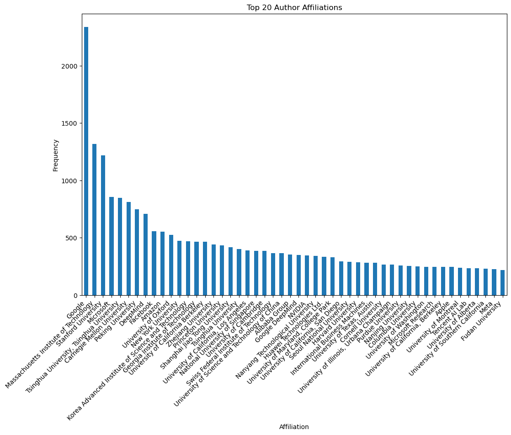

# 🔗 LinkedIn for AI-Researchers
## Table of Contents
* [About](#about)
* [Data acquisition](#data-acquisition)
* [Data preprocess](#data-preprocess)
* [Environment setting](#environment-setting)
* [Dataset](#dataset)
* [How to run](#how-to-run)
    * [XGBoost](#xgboost)
    * [GAT](#gat)
* [Performance](#performance)
    * [Analysis](#analysis)
---

## About
Career is a common interest for many AI-researchers. Unlike other job positions, the most important qualification for researchers is research fit with a company. However, it isn't easy to know what would be the company that will fit with one's research. 

To address this, we analyzed academic papers and their authors, specifically sourcing from [openreview](https://openreview.net), a prominent open-access archive. Our focus is on examining the affiliations of authors who contribute to leading AI conferences(NeurIPS, ICML, and ICLR), and discerning patterns between their research work and the institutions they are associated with. This project aims to serve as an effective career guidance tool, for not only the junior researchers but also senior researchers who are looking for their new and next career.

## Data acquisition 
**TODO** : Write about data acquisition and add source code. Write feature in table format.

### Author feature
* author_id
* name
### Paper feature
* paper_id
* year
* abstract
* keywords

## Data preprocess
After we obtain author and paper data, we made a single author node data by joining a *paper_id* column.  Also there was a data imbalancing problem in the original dataset.   

**TODO** 
  
As can be seen in the figure, most of the author affiliation is *Google*, (which is about ??%).  
Therefore, we performed oversampling/undersampling to solve the data imbalance problem.

## Environment setting
* NVCC : 11.6
* GPU : RTX 3090
```
conda env create --file environment.yaml
```

## Dataset
We provide our dataset [here](https://drive.google.com/drive/folders/1kS5mJAHnnpPLVAxf5LwrOYpMn0Wdm8Im?usp=sharing). Please download *dataset* folder and place it in your working directory.

## How to run
For reproducibility, simply change the *seed* into 0,1 and 2 and calculate the average accuracy.
### XGBoost
```

```

### GAT
```
CUDA_VISIBLE_DEVICES=0 python src/main.py \
    --dropout 0.4 \
    --feature_dim 1000 \
    --seed 0 \
    --lr 0.005 \
    --dim_h 1024 \
    --heads 8 \
    --model GAT
```

## Performance
This is average accuracy over 3 seeds.
* XGBoost : ??%
* GAT : 55%

### Analysis
Surprisingly, traditional machine learning approach (XGBoost) shows better performance than modern GNN models.  
We analyze the data and found that our data is highly disconnected which hinders global message passing between other nodes and prone to overfitting in a few subgraphs.
